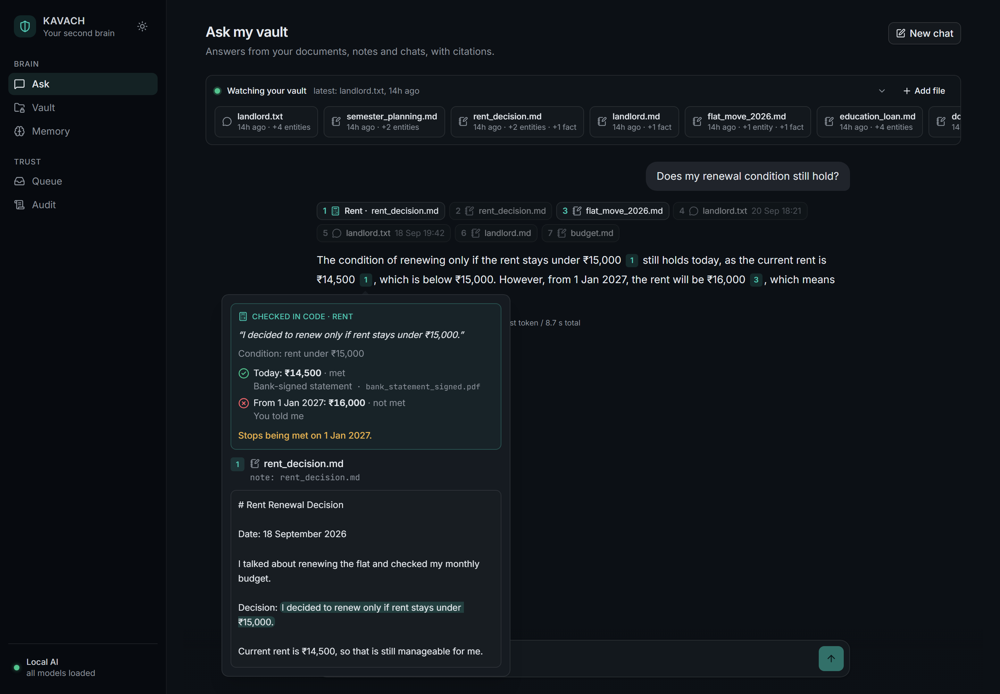
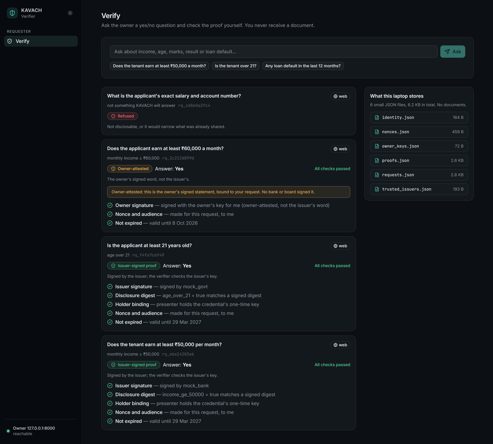
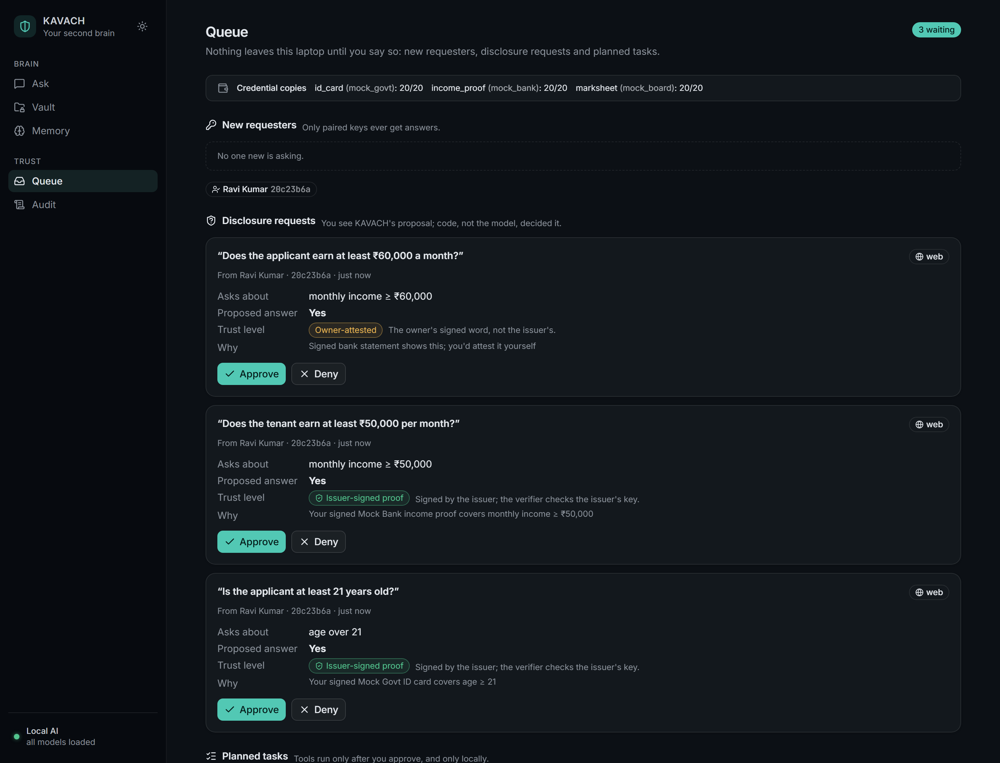
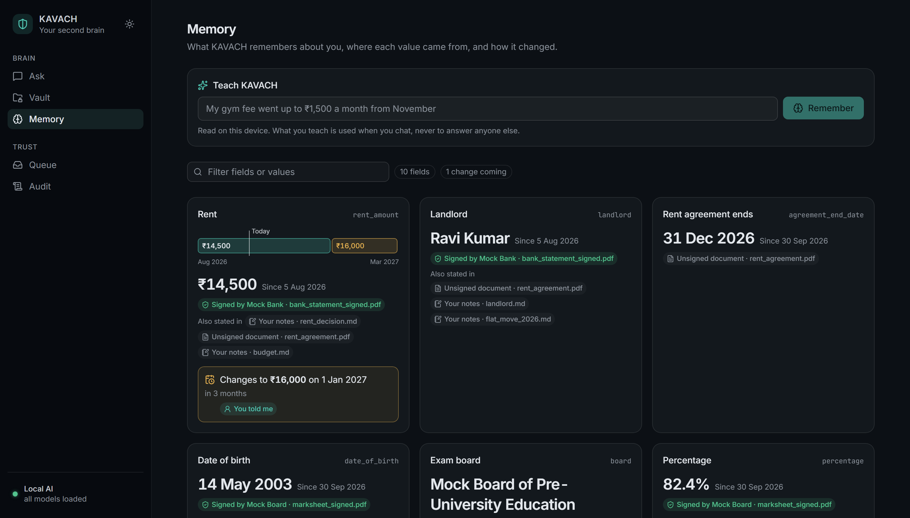
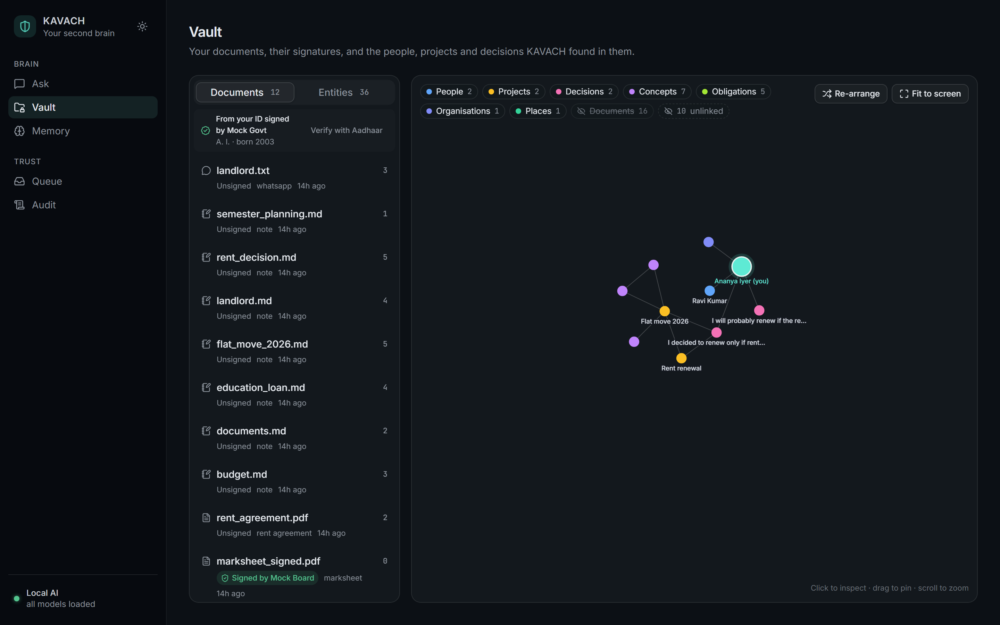
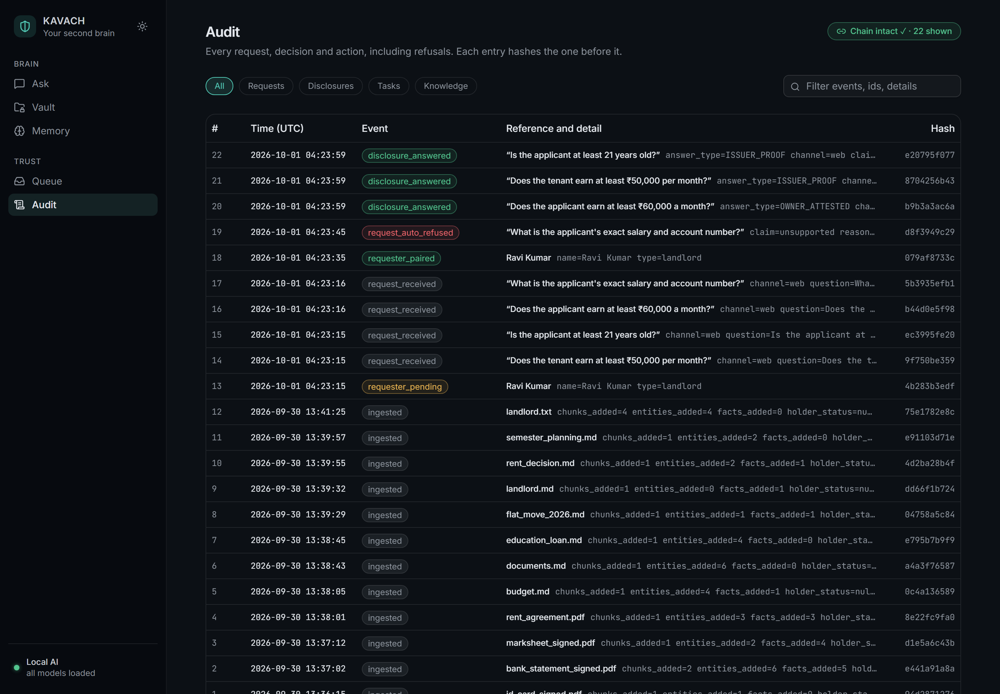
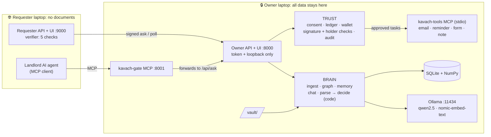
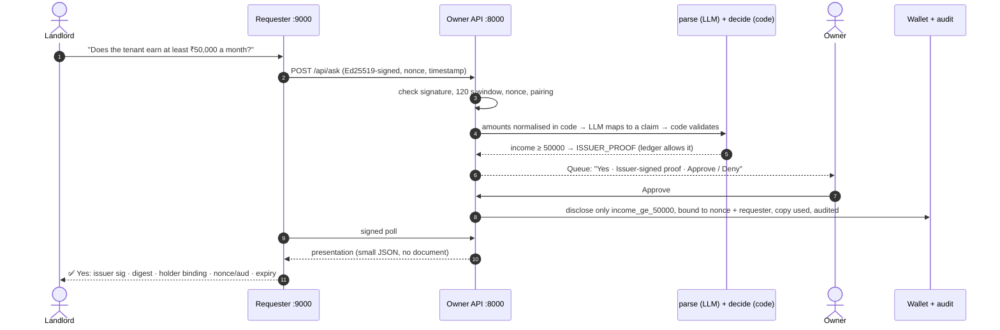

<div align="center">

# 🛡️ KAVACH

### A private second brain with a safe front door

**Your life's paperwork, understood by an AI that lives on your laptop.<br/>It answers you fully, with citations, and answers everyone else minimally.**

[](https://www.python.org/downloads/release/python-3128/)
[](https://nodejs.org/)
[](#-testing)
[-000000?logo=ollama&logoColor=white)](#-architecture)
[](#-benchmarks--maturity)
[](LICENSE)

**ASYNC'26 · Track 1: Sovereign AI · Team 1st Prize**

</div>

<!-- Demo video: add the link here once uploaded, e.g. [▶ Watch the 3-minute demo](https://...) -->

## 📌 Overview

**The problem.** Your important paperwork (bank statements, rent agreements, IDs, marksheets, chats) is scattered. Using AI on it means uploading everything to a vendor's cloud. Proving one fact (*"I earn over ₹50,000"*) means handing over the whole document. Both leak far more than necessary and work against the data-minimisation principle of India's DPDP Act.

**The solution.** KAVACH is a local-first second brain. Every model runs on your laptop, and it works with Wi-Fi off. It answers **you** fully, with a citation on every sentence. **Outsiders** (landlords, employers, their AI agents) only get yes/no answers backed by issuer signatures, never documents. Plain code decides what is disclosed, never the LLM.

**Who it's for:** students (marksheets, scholarships, rentals), young professionals (salary slips, rent, loans) and families (IDs, insurance, agreements).

| | Core features |
|---|---|
| 📥 **Ingestion** | Watches a `vault/` folder and ingests PDFs, Obsidian-style notes and WhatsApp exports automatically |
| 🧠 **Knowledge** | Hybrid search plus a graph of people, projects, decisions and obligations; every fact grounded in an exact source quote |
| 🕰️ **Memory** | Facts that change over time (*"₹14,500 today → ₹16,000 from 1 Jan 2027"*); learns from chat only after you confirm |
| 💬 **Ask my vault** | Streamed answers with a citation on every sentence; numbers and decision conditions **checked in code** |
| 🤖 **Tasks** | Email drafts, reminders, a filled rental-form PDF and notes, run through MCP tools only after you approve |
| 🔐 **Disclosure** | SD-JWT-style issuer proofs or owner attestations to outsiders over web or MCP; anti-snooping ledger; signed, replay-proof requests |
| 🪪 **Identity** | A signed document counts only if it's in your name; identity from Aadhaar offline e-KYC (UIDAI signature verified offline) |
| 📜 **Audit** | Hash-chained, tamper-evident log of everything, refusals included |

Full feature list in plain words: [`docs/FEATURES.md`](docs/FEATURES.md).

## 📸 Screenshots

These come from the real app on the demo vault, running `qwen2.5:3b` on a CPU-only laptop. Only the issuers are mocked.

<table>
<tr>
<td width="50%"><b>Ask</b>: cited answer; the rent condition is checked in code<br/></td>
<td width="50%"><b>Verify (landlord's laptop)</b>: five checks pass; a request for the exact salary is refused<br/></td>
</tr>
<tr>
<td><b>Queue</b>: the owner approves what code proposes<br/></td>
<td><b>Memory</b>: values over time, with sources and a scheduled change<br/></td>
</tr>
<tr>
<td><b>Vault</b>: documents, signature status, knowledge graph<br/></td>
<td><b>Audit</b>: hash-chained log, chain intact<br/></td>
</tr>
</table>

## 🏗️ Architecture

The **owner laptop** holds all data and models. The **requester laptop** (a landlord, say) holds only small JSON proofs. Only signed requests, presentations and attestations cross between them.



| Process | Port | Purpose |
|---|---|---|
| Owner API + UI (`kavach.api:app`) | 8000 | Owner routes (token + loopback) and requester-facing `/api/ask*` |
| `kavach-gate` | 8001 | Inbound MCP for AI agents; forwards to `/api/ask`, so web and MCP share one consent path |
| Requester API + UI (`requester.app:app`) | 9000 | Signs requests, verifies proofs with its **own** issuer trust list |
| Ollama | 11434 | Local open-weight models |

### End-to-end flow: a landlord asks, KAVACH proves the minimum



**Stack:** Python 3.12, FastAPI, Pydantic v2, SQLite + NumPy (no vector DB), Ollama, PyMuPDF, watchdog, `cryptography` (Ed25519), `signxml` (Aadhaar), MCP Python SDK 2.x, and on the frontend React 19 + Vite 8 + TypeScript + Tailwind + shadcn/ui, with every asset bundled and no CDN.

### 📚 Documentation

- [`docs/FEATURES.md`](docs/FEATURES.md): what KAVACH does, in plain words
- [`CONTRACT.md`](CONTRACT.md): the full interface spec (endpoints, schemas, credential formats, MCP tools, audit events)
- **OpenAPI / Swagger:** `http://localhost:8000/docs` (owner) and `http://localhost:9000/docs` (requester) when running
- [`docs/DECISIONS.md`](docs/DECISIONS.md): every design decision and why · [`docs/STATUS.md`](docs/STATUS.md): progress and measured runs

## ⚙️ Installation

### Prerequisites

| | Requirement |
|---|---|
| **Python** | 3.12 (pinned `requirements.txt` assumes it) |
| **Node.js** | ^20.19 or ≥ 22.12 (Vite 8), only to build the UI |
| **Ollama** | Any recent version (0.34.4 tested), running on the owner laptop |
| **Hardware** | 16 GB RAM recommended, **no GPU needed** (built and benchmarked on a Ryzen 7 7730U, CPU only), ~3 GB disk for models |
| **OS** | Windows, macOS or Linux |

### Steps

```bash
git clone https://github.com/Sky00raider/KAVACH.git && cd KAVACH

python3.12 -m venv .venv                 # Windows: py -3.12 -m venv .venv
source .venv/bin/activate                # Windows: .\.venv\Scripts\Activate.ps1
pip install -r requirements.txt

ollama pull qwen2.5:3b
ollama pull nomic-embed-text

cd frontend && npm install && npm run build && cd ..
python scripts/reset_demo.py             # mock issuers, signed PDFs, credentials, pre-ingested demo vault

# run each in its own terminal
uvicorn kavach.api:app --host 0.0.0.0 --port 8000 --no-proxy-headers   # owner → http://localhost:8000
python -m kavach.gate_mcp                                               # MCP gate → :8001/mcp
uvicorn requester.app:app --host 0.0.0.0 --port 9000                    # landlord → http://localhost:9000
```

Ask *"Does the tenant earn at least ₹50,000 a month?"* on the landlord page, then pair and approve in **Queue**.

**Two laptops:** copy `keys/issuers/trusted_issuers.json` to `requester/data/` on the requester laptop, set `OWNER_URL=http://<owner-ip>:8000` there, and run `python scripts/requester_preflight.py --reset` to check clocks, ports and keys. The requester laptop needs no Ollama.

### Environment variables

All settings live in [`kavach/config.py`](kavach/config.py). Each can be overridden by a shell environment variable of the same name (no `.env` file is loaded), and none are required for a one-laptop run.

| Variable | Type | Default | Required | Description |
|---|---|---|---|---|
| `OLLAMA_URL` | URL | `http://127.0.0.1:11434` | No | Ollama endpoint |
| `LLM_MODEL` | string | `qwen2.5:3b` | No | Chat and planner model (`qwen2.5:7b` also supported) |
| `FAST_MODEL` | string | `qwen2.5:3b` | No | Extraction, question parsing, memory |
| `EMBED_MODEL` | string | `nomic-embed-text` | No | Embedding model |
| `EMBED_DIM` | int | `768` | No | Embedding dimension |
| `EMBED_DOC_PREFIX` | string | `search_document: ` | No | Prefix for embedded chunks |
| `EMBED_QUERY_PREFIX` | string | `search_query: ` | No | Prefix for embedded queries |
| `OLLAMA_KEEP_ALIVE` | duration | `24h` | No | Keep models loaded |
| `NUM_CTX` | int | `8192` | No | Model context window |
| `CHAT_CONTEXT_TOKENS` | int | `800` | No | Token budget for chat history + retrieved text |
| `DB_PATH` | path | `./kavach.db` | No | SQLite database |
| `VAULT_DIR` | path | `./vault` | No | Watched folder |
| `OUTBOX_DIR` | path | `./outbox` | No | Task outputs (`.eml`, `.ics`, PDF) |
| `KEYS_DIR` | path | `./keys` | No | Issuer, wallet and owner-token keys |
| `FRONTEND_DIST` | path | `./frontend/dist` | No | Built UI |
| `DEMO_DATA_DIR` | path | `./demo_data` | No | Source for `reset_demo.py` |
| `API_PORT` / `GATE_PORT` / `REQUESTER_PORT` | int | `8000` / `8001` / `9000` | No | Ports |
| `OWNER_URL` | URL | `http://127.0.0.1:8000` | **Yes, on a separate requester laptop** | Where the requester reaches the owner |
| `OWNER_NAME` | string | `Ananya Iyer` | No | Fallback owner identity (the mock issuers' subject) |
| `OWNER_TOKEN` | string | random, in `keys/owner_token` | No | Owner API token |
| `CHUNK_SIZE` / `CHUNK_OVERLAP` | int | `600` / `100` | No | Chunking, in characters |
| `WATCH_DEBOUNCE_S` | float | `2` | No | Seconds a file must be quiet before ingest |
| `KAVACH_WATCH` | `0`/`1` | `1` | No | `0` turns off the watcher and model warm-up |
| `LEDGER_MIN_WIDTH` | JSON | `{"income": 25000, "percentage": 15}` | No | Narrowest range outsiders may infer |
| `LEDGER_MAX_ATTESTED_PER_30D` | int | `3` | No | Owner attestations per field per 30 days |
| `WALLET_LOW_COPIES` | int | `3` | No | Low credential-copy warning |
| `REQUESTER_DATA_DIR` | path | `./requester/data` | No | Requester keys and proofs |
| `REQUESTER_TRUST_LIST` | path | `requester/data/trusted_issuers.json` | No | Requester's issuer trust list |
| `VITE_USE_FIXTURES` | `0`/`1` | unset | No | Frontend runs on sample data, no backend |

## 🧑‍💻 Usage

```bash
TOKEN=$(cat keys/owner_token)    # owner routes accept it only from this machine

# Ask my vault (streamed, with citations)
curl -N http://localhost:8000/api/chat/stream -H "X-Owner-Token: $TOKEN" \
  -H "Content-Type: application/json" -d '{"question": "What is my rent?", "history": []}'

# Plan a task (runs only after POST /api/tasks/<id>/decision {"approve": true})
curl http://localhost:8000/api/tasks -H "X-Owner-Token: $TOKEN" -H "Content-Type: application/json" \
  -d '{"instruction": "Email my landlord that I will renew, and remind me a week before the agreement ends"}'

# As the landlord: ask, then read the verified result
curl http://localhost:9000/r/ask -H "Content-Type: application/json" \
  -d '{"question": "Does the tenant earn at least ₹50,000 a month?"}'
curl http://localhost:9000/r/requests

# As another AI agent, over MCP (tools: list_disclosable_claims, ask, get_answer)
python -m requester.agent_client "Is the tenant over 21?" --wait 60
```

## 🧪 Testing

```bash
pytest -m "not llm"                       # 804 fast tests, no Ollama needed
pytest                                    # all 827, incl. tests against real local models
cd frontend && npm test                   # 111 vitest tests
cd frontend && npm run build              # strict TypeScript typecheck + build
python scripts/run_eval.py                # evaluation sets A–E (C, the attacks, needs no model)
```

Fixtures are validated against the Pydantic models, and frontend API types are generated from OpenAPI. No linter, coverage tool or CI workflow is set up yet; the badge numbers come from local runs on 1 Oct 2026.

## 📊 Benchmarks & maturity

**Status: Alpha (hackathon prototype).** Every feature runs end to end on the demo vault, but nothing has been hardened for production. All numbers below were measured on a CPU-only laptop (Ryzen 7 7730U, `qwen2.5:3b`).

| Eval set | n | Result | Median latency |
|---|---|---|---|
| **A**: vault questions (answer + citation) | 15 | 15/15 answers, 14/15 citations | 10.9 s |
| **B**: disclosure questions | 15 | 15/15, **0 wrong disclosures** | 1.5 s |
| **C**: attacks (tamper, replay, forwarding, altered value, collusion, unpaired) | 6 | **6/6 blocked**, audit chain intact | ~3 s total |
| **D**: tasks (right tool, recipient, date) | 5 | 5/5 | 3.8 s |
| **E**: memory updates | 5 | 5/5 | 1.7 s |

| Operation | Latency |
|---|---|
| Vault answer, first token / full (warm, ~990-token prompt) | 8.7 s / 10.5 s |
| Outsider question → claim | ~1.3–2 s (8/8 adversarial phrasings blocked) |
| Drop a note → fully ingested | ~12 s |

Sets A and B are synthetic for now; an outside-written set A is pending. Model selection data: [`docs/DECISIONS.md`](docs/DECISIONS.md#appendix-a-model-benchmark-26-sep-2026).

**What's real and what's simulated:**
- **Real:** local AI, the graph and memory, citation checks, the signature and holder checks, selective-disclosure cryptography, the ledger, MCP and the audit chain.
- **Simulated:** the issuers are a mock bank, board and government office signing with Ed25519. Emails are written to `outbox/` as `.eml` files instead of being sent.
- **Not claimed:** formal SD-JWT compliance, zero-knowledge proofs or DigiLocker integration.

## 🛠️ Troubleshooting & known limitations

| Problem | Fix |
|---|---|
| `503 local model unavailable` | Start Ollama and pull `qwen2.5:3b` and `nomic-embed-text` |
| Very slow answers on Windows | Plug in and turn off power saver (it halves CPU prefill speed) |
| Owner UI gets `401`/`403` | Open it at `http://localhost:8000` on the owner laptop. LAN access is blocked by design |
| Blank page | Build the frontend: `cd frontend && npm run build` |
| Requester: "Owner signature" ✗ or `stale_ts` | Run `python scripts/requester_preflight.py --reset` and sync both clocks (±120 s) |
| Requester: "Issuer signature" ✗ | Copy `keys/issuers/trusted_issuers.json` to `requester/data/` on the requester laptop |

**Limitations:**
- The issuers are mocked.
- Aadhaar e-KYC has been tested with UIDAI-format files but not yet with a real one.
- A vault answer takes about 10 s on CPU.
- `qwen2.5:3b` citations can occasionally point at a neighbouring source.
- Only the first 8 chunks of each document go through extraction (search still covers everything).
- It is built for one person; organisation mode is roadmap only.

## 🔒 Security

Please don't open public issues for vulnerabilities. Report them privately via **[GitHub private vulnerability reporting](https://github.com/Sky00raider/KAVACH/security/advisories/new)** with the affected component, steps to reproduce and the impact. Of most interest: anything that leaks document text or values to a requester, unapproved disclosures, proof replay or linkability, ledger bypasses, and owner-token or audit-chain weaknesses.

## 🤝 Contributing

Read [`AGENTS.md`](AGENTS.md) first. It covers the hard rules, track ownership, conventions and commands. In short:

- no cloud inference;
- the LLM never decides disclosures;
- every fact is grounded in a source quote;
- [`CONTRACT.md`](CONTRACT.md) is the source of truth for interfaces;
- every commit uses [Conventional Commits](https://www.conventionalcommits.org/) and passes `pytest -m "not llm"`;
- every design change adds a line to `docs/DECISIONS.md`.

## 📄 License

KAVACH's own code is **[MIT](LICENSE)**, © 2026 Team 1st Prize.

- **PyMuPDF** is AGPL-3.0 (or commercially licensed by Artifex). Redistributing KAVACH with it must meet the AGPL's terms; see [PyMuPDF's licence page](https://pymupdf.readthedocs.io/en/latest/about.html#license-and-copyright).
- The other dependencies are MIT, BSD or Apache-2.0. The bundled fonts are under the SIL OFL 1.1.
- Models are downloaded by Ollama, not shipped here. `qwen2.5:7b` and `nomic-embed-text` are Apache-2.0; `qwen2.5:3b` is under the Qwen Research License, which **does not allow commercial use**.

**How this was built:** an idea deck and project plan ([`docs/archive/`](docs/archive/)) came before this repo, but no code did. The team used AI assistants during development (Claude Code for code, chat assistants for content). The product itself uses no cloud AI.

## 👥 Team

| Contributor | GitHub |
|---|---|
| Niranjan Nishore | [@Sky00raider](https://github.com/Sky00raider) |
| Harshinee | [@tekera0](https://github.com/tekera0) |
| Ramith B Nayak | [@ramithnayak8](https://github.com/ramithnayak8) |
