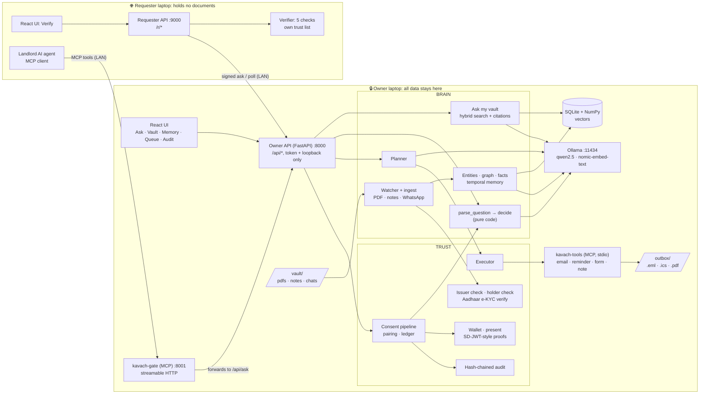
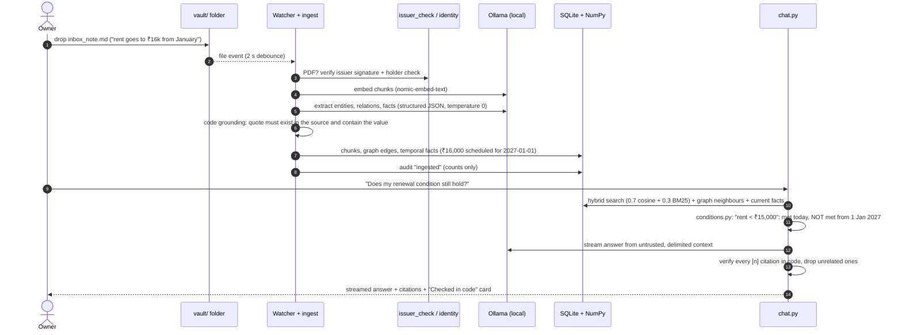
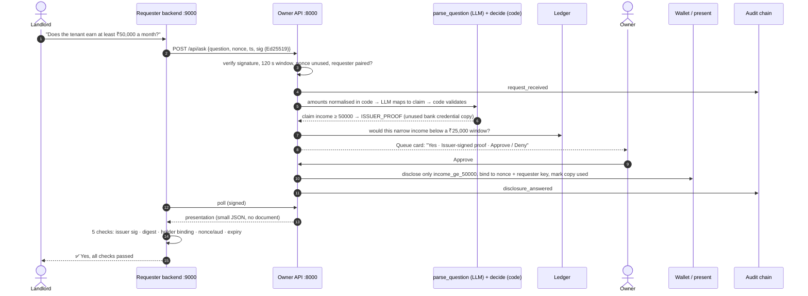

<div align="center">

# 🛡️ KAVACH

### A private second brain with a safe front door

**Your life's paperwork, understood by an AI that lives on your laptop.<br/>It answers you fully, with citations, and answers everyone else minimally.**

[](https://www.python.org/downloads/release/python-3128/)
[](https://nodejs.org/)
[](#-testing--quality-control)
[](#-testing--quality-control)
[-000000?logo=ollama&logoColor=white)](#-architecture)
[](#-benchmarks--maturity)
[](LICENSE)

**ASYNC'26 · Track 1: Sovereign AI · Team 1st Prize**

[Features](#-what-kavach-does) · [Screenshots](#-screenshots) · [Architecture](#-architecture) · [Quick start](#-installation) · [Usage](#-usage) · [Benchmarks](#-benchmarks--maturity) · [Docs](#-documentation)

</div>

<!-- Demo video: add the link here once uploaded, e.g. [▶ Watch the 3-minute demo](https://...) -->

---

## 📌 The problem

Your important knowledge (bank statements, rent agreements, ID cards, marksheets, WhatsApp chats, notes) is scattered across folders and apps. Today you have two bad options:

1. **To get AI help with it**, you upload everything to a vendor's cloud.
2. **To prove one fact about yourself** (*"I earn over ₹50,000"*, *"I'm over 21"*), you hand over the whole document: account number, transactions, address and all.

Each step leaks far more than necessary and works against the data-minimisation principle of India's **DPDP Act**.

## 💡 The solution

KAVACH is a **local-first second brain** that runs entirely on your laptop, with no cloud AI and no CDNs, and works with Wi-Fi off.

- **For you (the owner):** it reads your files automatically, builds a knowledge graph with memory that tracks time, answers questions **with a citation on every sentence**, and runs tasks you approve.
- **For everyone else (landlords, employers and their AI agents):** they get **yes/no answers backed by issuer signatures**, in an SD-JWT style. They never get documents. **Plain code decides what is disclosed, never the LLM.**
- **For accountability:** every request, refusal, decision and action goes into a **hash-chained audit log**.

### Who it's for

| Audience | Typical paperwork | Typical "prove one fact" moment |
|---|---|---|
| **Students** | Marksheets, scholarship letters, hostel/rent agreements | "Scored at least 75%?", "Over 18?" |
| **Young professionals** | Salary slips, bank statements, loan papers | Landlord: "Earns at least ₹50k a month?" |
| **Families** | IDs, insurance, property agreements | "No loan default in the last 12 months?" |

---

## ✨ What KAVACH does

| Stage | What KAVACH does |
|---|---|
| **📥 Data** | Watches a local `vault/` folder and ingests PDFs, Obsidian-style notes (with `[[links]]`) and WhatsApp exports by itself. When a file changes it is updated; when a file is deleted it is forgotten, but its history is kept |
| **🧠 Knowledge** | Chunks plus embeddings (hybrid vector and keyword search), and a graph of **people, projects, concepts, decisions and obligations**. Facts are **grounded**: each one carries an exact source quote that code checks |
| **🕰️ Memory** | Facts that change over time (*"₹14,500 today → ₹16,000 from 1 Jan 2027"*). It learns from conversation **only after you confirm**, and you can teach it directly |
| **💬 Reasoning** | "Ask my vault" streams answers with a citation on every sentence. Numbers, dates and decision conditions are **checked in code** and shown as a "Checked in code" card. If the answer isn't in your files, it says so |
| **🤖 Action** | Tasks you approve run through MCP tools: email drafts, calendar reminders, a filled rental-form PDF and saved notes. Nothing runs until you click approve |
| **🔐 Disclosure** | Outsiders and their AI agents ask yes/no questions over the web or MCP. They receive **issuer-verifiable selective disclosures** or owner attestations, and their verifier checks five cryptographic properties |
| **🪪 Identity** | A signed document counts as yours **only if it is in your name** (the holder check). Your identity comes from **Aadhaar offline e-KYC** (UIDAI's signature is verified offline), or else from a signed ID card |
| **📜 Audit** | A hash-chained, tamper-evident log of everything, refusals included, with no document text or personal values in it |

<details>
<summary><b>The five possible answers an outsider can get</b></summary>

| Answer | Meaning | Who decides |
|---|---|---|
| ✅ **Issuer proof** | A holder-bound selective-disclosure credential from the bank, board or government. It reveals one claim, can be used once, and can't be linked across requesters | Code proposes, owner approves |
| 🟡 **Owner-attested** | The owner signs the answer themselves, only when a signed document **in their own name** backs it | Code proposes, owner approves |
| ⛔ **Declined** | The owner chose not to answer | Owner |
| ❔ **Cannot confirm** | No signed document in the owner's name covers it | Code, automatically |
| 🚫 **Refused** | Not disclosable (exact amounts, addresses, documents), or blocked by the anti-snooping ledger | Code, automatically |

</details>

<details>
<summary><b>Security features built into the design</b></summary>

- **Local inference only:** every model call goes to Ollama on this machine (or your own GPU box via `OLLAMA_URL`).
- **The LLM never decides.** It extracts, summarises and maps questions to claims. Python compares values, checks signatures, validates tool arguments and decides disclosures.
- **Prompt-injection resistant chat:** vault text is passed to the model as untrusted data inside escaped delimiters, and citations are verified in code.
- **Tampered PDFs are caught:** the issuer signature is re-verified on ingest, and a tampered document is excluded from answers, memory and the graph.
- **Holder check:** a friend's *genuinely signed* bank statement gets an amber "Signed, but not in your name" badge and can never back an answer.
- **Anti-snooping ledger:** blocks narrowing attacks (asking ₹50k, then ₹55k, then ₹60k) **even across colluding requesters**, and limits owner attestations to 3 per field per 30 days.
- **Signed, replay-proof requests:** Ed25519 signatures, a 120-second timestamp window, nonce reuse rejected, and a pairing approval for every new requester.
- **Owner API locked to this laptop:** it needs a token, a loopback client address *and* a loopback `Host` header. Proxy headers are ignored and DNS rebinding is blocked.
- **Data minimisation everywhere:** Aadhaar import keeps only name, date of birth and last 4 digits, and the audit log keeps only IDs and counts.

</details>

---

## 📸 Screenshots

All screenshots are from the real app running on the demo vault with `qwen2.5:3b` on a CPU-only laptop. Nothing is mocked except the issuers.

<table>
<tr>
<td width="50%">

**Ask my vault**: cited answer; the renewal condition is checked in code and the source passage is highlighted


</td>
<td width="50%">

**Verify (requester laptop)**: issuer proofs pass all five checks; a request for the exact salary is refused


</td>
</tr>
<tr>
<td>

**Queue**: the owner sees what code proposes, with the trust level and the reason


</td>
<td>

**Memory**: values that change over time, with sources and a scheduled change


</td>
</tr>
<tr>
<td>

**Vault**: documents with signature status and the knowledge graph


</td>
<td>

**Audit**: hash-chained log, refusals included, chain intact


</td>
</tr>
</table>

---

## 🏗️ Architecture

### System design and service boundaries

KAVACH runs on **two machines**: the **owner laptop**, which holds all data and models, and a **requester laptop** (a landlord, say), which holds only small JSON proofs. The only things that cross the boundary are signed requests, presentations and attestations.



| Process | Port | Runs on | Purpose |
|---|---|---|---|
| Owner API + built UI (`kavach.api:app`) | `8000` | Owner laptop | `/api/*` owner routes (token + loopback), plus requester-facing `/api/ask*`, `/api/claims` |
| `kavach-gate` MCP server | `8001` | Owner laptop | Inbound MCP for other AI agents. A thin adapter that forwards every call to `/api/ask*`, so web and MCP share one consent path |
| `kavach-tools` MCP server | stdio | Owner laptop | Outbound tools, spawned only by the executor for approved tasks |
| Requester API + built UI (`requester.app:app`) | `9000` | Requester laptop | `/r/*`: signs requests, polls, verifies with **its own** issuer trust list |
| Ollama | `11434` | Owner laptop (or your GPU box) | Local open-weight models |
| Vite dev server | `5173` | Dev only | Hot reload, proxies `/api` and `/r` |

### End-to-end flow 1: from a dropped file to a cited answer



### End-to-end flow 2: a landlord asks, KAVACH proves the minimum



> **Design rule:** the LLM only *reads* the outsider's question. Thresholds are normalised in code before the model sees them (`₹50k`, `1.2 lakh` → integers). The model's output is validated against a fixed claim table, and anything off-table ends as `REFUSED`. Every disclosure decision is plain Python ([`kavach/brain/decide.py`](kavach/brain/decide.py)).

### Tech stack

| Layer | Technology |
|---|---|
| Backend | Python 3.12, FastAPI, Uvicorn, Pydantic v2 |
| Storage and search | SQLite, NumPy (hybrid vector and BM25 search; no extensions, no vector DB service) |
| Local AI | Ollama: `qwen2.5:3b` (laptop default), `qwen2.5:7b` (GPU host), `nomic-embed-text` (768-d) |
| Documents | PyMuPDF (PDF text), watchdog (folder watcher) |
| Cryptography | `cryptography` (Ed25519, SHA-256), `signxml` + `pyzipper` (UIDAI Aadhaar offline e-KYC) |
| Agents | `mcp` Python SDK 2.x: streamable-HTTP gate in, stdio tools out |
| Frontend | React 19, Vite 8, TypeScript 5.9, Tailwind v4, shadcn/ui, `react-force-graph-2d`; fonts and icons bundled (no CDN) |
| Tests | pytest, vitest |

---

## 📚 Documentation

| Document | What's in it |
|---|---|
| [`docs/FEATURES.md`](docs/FEATURES.md) | Every feature in plain words: the best place to start |
| [`CONTRACT.md`](CONTRACT.md) | **The interface spec:** repo layout, ports, config, knowledge and disclosure model, credential formats, SQLite schema, every endpoint, SSE stream protocol, MCP tools, audit events |
| **OpenAPI / Swagger** | Live at **`http://localhost:8000/docs`** (owner API) and **`http://localhost:9000/docs`** (requester API) once running; raw JSON at `/openapi.json` |
| [`docs/DECISIONS.md`](docs/DECISIONS.md) | Every design decision with its reason, plus the model benchmark appendix |
| [`docs/STATUS.md`](docs/STATUS.md) | Technical progress log with measured runs |
| [`docs/BUILD_PLAN.md`](docs/BUILD_PLAN.md) | Original component design, evaluation plan and demo-day checklist |
| [`AGENTS.md`](AGENTS.md) | Hard rules, conventions and commands for contributors (human or AI) |
| [`docs/pitch/demo_script.md`](docs/pitch/demo_script.md) | The 3-minute demo script |

---

## ⚙️ Installation

### Prerequisites

| Requirement | Version / bound | Notes |
|---|---|---|
| **Python** | **3.12** (3.12.8 tested) | The venv and pinned `requirements.txt` assume 3.12 |
| **Node.js** | **^20.19 or ≥ 22.12** (24.x tested) | Required by Vite 8; only for building the UI |
| **Ollama** | 0.3x or newer (0.34.4 tested) | <https://ollama.com>; must run on the owner laptop (or point `OLLAMA_URL` at your own box) |
| **RAM** | 16 GB recommended | `qwen2.5:3b` + `nomic-embed-text` resident ≈ 3 GB; `qwen2.5:7b` ≈ 5 GB more |
| **CPU / GPU** | **No GPU required** | Developed, tested and benchmarked on a Ryzen 7 7730U, CPU only |
| **Disk** | ≈ 3 GB for models | `qwen2.5:3b` ≈ 1.9 GB, `nomic-embed-text` ≈ 0.3 GB (`qwen2.5:7b` ≈ 4.7 GB optional) |
| **OS** | Windows 10/11, macOS, Linux | All scripts are Python, so they run the same everywhere |

### Step-by-step (one laptop, full demo)

**1. Clone and create the Python environment**

```bash
git clone https://github.com/Sky00raider/KAVACH.git
cd KAVACH

python3.12 -m venv .venv
source .venv/bin/activate            # Windows PowerShell: .\.venv\Scripts\Activate.ps1
pip install -r requirements.txt
```

<sub>Windows: use `py -3.12 -m venv .venv`. If activation is blocked, run `Set-ExecutionPolicy -Scope CurrentUser RemoteSigned` once.</sub>

**2. Pull the local models**

```bash
ollama pull qwen2.5:3b
ollama pull nomic-embed-text
# optional, for a GPU host:  ollama pull qwen2.5:7b
```

**3. Build the frontend**

```bash
cd frontend
npm install
npm run build        # typecheck + build to frontend/dist (served by FastAPI)
cd ..
```

**4. Create the demo vault** (mock issuer keys, signed PDFs, 20-copy credential batches, pre-ingested vault, DB backup)

```bash
python scripts/reset_demo.py
```

**5. Run it** (three terminals, venv activated in each)

```bash
# Owner API + UI → http://localhost:8000
uvicorn kavach.api:app --host 0.0.0.0 --port 8000 --no-proxy-headers

# Inbound MCP gate for AI agents → :8001/mcp
python -m kavach.gate_mcp

# Requester (landlord) API + UI → http://localhost:9000
uvicorn requester.app:app --host 0.0.0.0 --port 9000
```

Open **<http://localhost:8000>** as the owner and **<http://localhost:9000>** as the landlord. Ask *"Does the tenant earn at least ₹50,000 a month?"* on the requester page, then pair and approve in **Queue**.

> ⚠️ **Always pass `--no-proxy-headers`** to the owner API. The owner routes trust only the real client address.

### Two-laptop setup

```bash
# On the OWNER laptop: print issuer fingerprints to compare
python scripts/requester_preflight.py --fingerprints

# Copy keys/issuers/trusted_issuers.json  →  requester laptop: requester/data/trusted_issuers.json

# On the REQUESTER laptop (no Ollama needed)
export OWNER_URL=http://<owner-ip>:8000          # PowerShell: $env:OWNER_URL = "http://<owner-ip>:8000"
python scripts/requester_preflight.py --owner $OWNER_URL --reset
uvicorn requester.app:app --host 0.0.0.0 --port 9000
python -m requester.agent_client                  # optional: the scripted landlord AI agent over MCP
```

Open ports `8000`, `8001` and `9000` in both firewalls. The preflight checks the frontend build, the trust list, owner reachability, clock skew (requests are rejected beyond ±120 s) and the gate port.

### UI development without a backend

```bash
cd frontend
VITE_USE_FIXTURES=1 npm run dev     # PowerShell: $env:VITE_USE_FIXTURES = "1"; npm run dev
```

Every screen works from `fixtures/api/*.json`, which a pytest test validates against the Pydantic models.

### Environment variables

Every setting lives in [`kavach/config.py`](kavach/config.py) and can be overridden by an environment variable of the same name. **None are required for a one-laptop run.** Shell environment variables are read; no `.env` file is loaded automatically.

| Variable | Type | Default | Required | Description |
|---|---|---|---|---|
| `OLLAMA_URL` | URL | `http://127.0.0.1:11434` | No | Ollama endpoint. A non-loopback host switches the UI to "on your self-hosted server" |
| `LLM_MODEL` | string | `qwen2.5:3b` | No | Chat and planner model. Use `qwen2.5:7b` on a GPU host |
| `FAST_MODEL` | string | `qwen2.5:3b` | No | Extraction, question parsing, memory |
| `EMBED_MODEL` | string | `nomic-embed-text` | No | Embedding model |
| `EMBED_DIM` | int | `768` | No | Embedding dimension (must match `EMBED_MODEL`) |
| `EMBED_DOC_PREFIX` | string | `search_document: ` | No | nomic task prefix for chunks |
| `EMBED_QUERY_PREFIX` | string | `search_query: ` | No | nomic task prefix for queries |
| `OLLAMA_KEEP_ALIVE` | duration | `24h` | No | Keeps models resident between calls |
| `NUM_CTX` | int | `8192` | No | Ollama context window on chat and structured calls |
| `CHAT_CONTEXT_TOKENS` | int | `800` | No | Token budget for chat history plus retrieved chunks (CPU latency control) |
| `DB_PATH` | path | `./kavach.db` | No | SQLite database |
| `VAULT_DIR` | path | `./vault` | No | Watched folder (`pdfs/`, `notes/`, `chats/`) |
| `OUTBOX_DIR` | path | `./outbox` | No | Task outputs (`.eml`, `.ics`, filled PDF) |
| `KEYS_DIR` | path | `./keys` | No | Issuer keys, wallet keys, owner token |
| `FRONTEND_DIST` | path | `./frontend/dist` | No | Built UI served by both backends |
| `DEMO_DATA_DIR` | path | `./demo_data` | No | Source for `reset_demo.py` |
| `API_PORT` | int | `8000` | No | Owner API port (the gate forwards here) |
| `GATE_PORT` | int | `8001` | No | `kavach-gate` MCP port |
| `REQUESTER_PORT` | int | `9000` | No | Requester API port |
| `OWNER_URL` | URL | `http://127.0.0.1:{API_PORT}` | **Yes, on a separate requester laptop** | Where the requester reaches the owner |
| `OWNER_NAME` | string | `Ananya Iyer` | No | Owner's name (the mock issuers' subject); the fallback identity anchor |
| `OWNER_TOKEN` | string | random, saved in `keys/owner_token` | No | Owner API token; created on the API's first use, never replaced |
| `CHUNK_SIZE` | int | `600` | No | Chunk size (characters) |
| `CHUNK_OVERLAP` | int | `100` | No | Chunk overlap (characters) |
| `WATCH_DEBOUNCE_S` | float | `2` | No | Seconds a file must be quiet before ingest |
| `KAVACH_WATCH` | `0`/`1` | `1` | No | `0` disables the vault watcher and startup warm-up (tests) |
| `LEDGER_MIN_WIDTH` | JSON | `{"income": 25000, "percentage": 15}` | No | Narrowest range the ledger lets outsiders infer, per field |
| `LEDGER_MAX_ATTESTED_PER_30D` | int | `3` | No | Distinct owner-attested thresholds per field per 30 days |
| `WALLET_LOW_COPIES` | int | `3` | No | Warn when unused credential copies drop below this |
| `REQUESTER_DATA_DIR` | path | `./requester/data` | No | Requester keys, requests, proofs, pinned owner keys |
| `REQUESTER_TRUST_LIST` | path | `requester/data/trusted_issuers.json` | No | The requester's own issuer trust list |
| `VITE_USE_FIXTURES` | `0`/`1` | unset | No | Frontend fixture mode (build-time) |

---

## 🧑‍💻 Usage

The owner token is in `keys/owner_token`. Owner routes accept it **only from this machine**.

```bash
TOKEN=$(cat keys/owner_token)          # PowerShell: $TOKEN = Get-Content keys/owner_token
```

**Health: are the local models loaded?**

```bash
curl -s http://localhost:8000/api/health -H "X-Owner-Token: $TOKEN"
# {"ollama":true,"models":{"llm":"qwen2.5:3b",...},"model_loaded":{"llm":true,...},"local_inference":true}
```

**Ask my vault, streamed (Server-Sent Events)**

```bash
curl -N http://localhost:8000/api/chat/stream \
  -H "X-Owner-Token: $TOKEN" -H "Content-Type: application/json" \
  -d '{"question": "What is my rent and who do I pay it to?", "history": []}'
# event: meta   data: {"entities_used":[...],"chunks":[{"n":1,"chunk_id":"c_...","locator":"page 1"}]}
# event: token  data: {"text":"Your rent is ₹14,500 ..."}
# event: final  data: {"answer":"...","citations":[...],"citation_ok":true,"flags":[]}
# event: done   data: {"latency_ms":8700,"first_token_ms":7100,"prompt_tokens":983}
```

**Add a file** (the watcher ingests it within seconds)

```bash
curl -s http://localhost:8000/api/ingest -H "X-Owner-Token: $TOKEN" -F "file=@demo_data/notes/inbox_note.md"
```

**Teach KAVACH**

```bash
curl -s http://localhost:8000/api/memory -H "X-Owner-Token: $TOKEN" -H "Content-Type: application/json" \
  -d '{"statement": "My gym fee went up to ₹1,500 from November"}'
```

**Plan a task** (nothing runs until approved)

```bash
curl -s http://localhost:8000/api/tasks -H "X-Owner-Token: $TOKEN" -H "Content-Type: application/json" \
  -d '{"instruction": "Email my landlord that I will renew, and remind me a week before the agreement ends"}'
# → plan: draft_email to ravi.landlord@example.com + create_reminder 2026-12-24, with previews
curl -s http://localhost:8000/api/tasks/<task_id>/decision -H "X-Owner-Token: $TOKEN" \
  -H "Content-Type: application/json" -d '{"approve": true}'
```

**As a requester (landlord)**

```bash
curl -s http://localhost:9000/r/ask -H "Content-Type: application/json" \
  -d '{"question": "Does the tenant earn at least ₹50,000 a month?"}'
curl -s http://localhost:9000/r/requests      # verified results, with all five checks
curl -s http://localhost:9000/r/storage       # proof that only small JSON files are held
```

**As another AI agent over MCP** (`kavach-gate`, streamable HTTP at `:8001/mcp`)

```bash
python -m requester.agent_client "Is the tenant over 21?" --wait 60
```

| MCP tool (`kavach-gate`) | Purpose |
|---|---|
| `list_disclosable_claims` | Claim names and which are issuer-provable (never values) |
| `ask` | Signed question → `{request_id, status}` |
| `get_answer` | Signed poll → presentation / attestation / refusal |

**Utility scripts**

| Command | What it does |
|---|---|
| `python scripts/reset_demo.py` / `--restore` | Clean pre-loaded demo vault / restore the backup in seconds |
| `python scripts/make_friend_statement.py` | Genuinely signed statement in someone else's name (holder-check demo) |
| `python scripts/check_aadhaar.py private/<file>.zip` | Verify a real Aadhaar offline e-KYC; prints only yes/no, issuer, initials, birth year |
| `python scripts/requester_preflight.py` | Two-laptop readiness check |
| `python scripts/run_eval.py [--sets B,C]` | Evaluation sets A–E → `eval/results/<utc>.json` |
| `python scripts/bench_models.py --runs 3` | Time the configured models on local Ollama |

---

## 🧪 Testing & quality control

```bash
pytest -m "not llm"            # fast suite: 804 tests, no Ollama needed (LLM calls faked in tests/conftest.py)
pytest                         # full suite: 827 tests, incl. 23 that call real local models (Ollama running)
pytest tests/test_disclosure_privacy.py tests/test_trust_consent.py   # privacy + attack tests only

cd frontend
npm test                       # vitest: 111 tests (API client, SSE parser, answer/citation logic, graph, memory)
npm run typecheck              # tsc -b, strict TypeScript
npm run build                  # typecheck + production build

python scripts/run_eval.py     # end-to-end evaluation sets (A, B, D, E need Ollama; C does not)
python scripts/run_eval.py --sets C   # the 6 attacks only; exit code 1 if any gets through
```

| Quality gate | How it's enforced |
|---|---|
| Contract drift | Every API fixture is validated against its Pydantic model (`tests/test_fixtures.py`); TS types are **generated** from OpenAPI (`npm run gen:types`), never hand-written |
| Static typing | Pydantic v2 for every cross-module and wire type (`kavach/models.py`); strict `tsc` on the frontend |
| Privacy invariants | `tests/test_disclosure_privacy.py`: every outcome runs through the real consent pipeline, and owner-only text is searched for on every requester-facing surface (`/api/ask*`, MCP tools, presentations, `/r/*`) |
| Attacks | `tests/test_trust_consent.py` + eval set C: tampered doc, replay, forwarded proof, altered disclosure, colluding narrowing, unpaired requester |
| Audit integrity | Hash-chain verification and tamper detection are tested |
| Pre-commit rule | `pytest -m "not llm"` must pass before every commit (see [`AGENTS.md`](AGENTS.md)) |

> No Python linter or coverage tool is configured yet, and there is no CI workflow. All test badges reflect local runs on 1 Oct 2026.

---

## 📊 Benchmarks & maturity

**Maturity: Alpha (hackathon prototype).** Every feature listed above runs end to end on the demo vault. It has not been hardened for production use; see [Known limitations](#known-limitations-and-trade-offs).

### Evaluation results

Dry run on the owner laptop: Ryzen 7 7730U, CPU only, `qwen2.5:3b`, on a scratch copy of the reset demo vault. Sets are in [`eval/`](eval/), and the runner is [`scripts/run_eval.py`](scripts/run_eval.py).

| Set | What it measures | n | Result | Median latency |
|---|---|---|---|---|
| **A**: Ask my vault | Correct answer + correct citation (≥ 4 cross-document, ≥ 3 about projects/decisions) | 15 | **15/15** answers · 14/15 citations* | 10.9 s |
| **B**: Disclosures | Correct answer type; **wrong disclosures** | 15 | **15/15** · **0 wrong disclosures** | 1.5 s |
| **C**: Attacks | Tampered doc, replay, forwarded proof, altered value, 3-key collusion, unpaired requester | 6 | **6/6 blocked**, audit chain intact | ≈ 3 s total |
| **D**: Tasks | Valid plan, right recipient + date, nothing runs unapproved | 5 | **5/5** | 3.8 s |
| **E**: Memory | New value becomes current, old one superseded; "from January" stays scheduled | 5 | **5/5** | 1.7 s |

<sub>*a01 cited the bank-signed statement, which was correct but not in the expected list; the list has since been fixed. Sets A and B are currently synthetic (`"real": false`); an outside-written set A is pending. All numbers in this section are from a CPU-only laptop.</sub>

### Latency (owner laptop, CPU only, AC power, power saver off)

| Operation | Model | Measured |
|---|---|---|
| Vault question, first token / full answer (salary question, ~990 prompt tokens, warm) | `qwen2.5:3b` | **8.7–8.8 s / 10.4–10.7 s** |
| Same question | `qwen2.5:7b` | 19.8 s / 23.8 s |
| Prompt prefill throughput | 3b / 7b | ≈ 117 / 50 tokens/s |
| Outsider question → claim (parse) | `qwen2.5:3b` | ≈ 1.3–2 s; 15/15 supported, **8/8 adversarial blocked** |
| Drop a note → fully ingested (entities + facts) | `qwen2.5:3b` | **11.5–12.2 s** (incl. 2 s debounce) |
| Embed 100 chunks | `nomic-embed-text` | 21.5 s |
| Five-check verification on the requester | none (pure crypto) | milliseconds; the requester needs no model |

<details>
<summary><b>Model selection benchmark</b> (<code>scripts/bench_models.py --runs 3</code>, medians, 26 Sep 2026)</summary>

| LLM / FAST | Chat first token | Chat full answer | Parse | Parse correct | Embed 100 chunks |
|---|---|---|---|---|---|
| **qwen2.5:7b / qwen2.5:3b** | 0.18 s | 6.9 s | 1.40 s | **3/3** | 21.6 s |
| qwen3:8b / qwen3:4b (thinking on) | 51.5 s | 57.1 s | 4.39 s | 0/3 | 21.6 s |
| qwen3:8b / qwen3:4b (`think=false`) | 0.19 s | 6.1 s | 2.51 s | 0/3 | 22.5 s |

The qwen3 models parsed "50k" as the string `"50k"`, which is why amounts are now normalised in code before any model sees them. The bench uses a short cached prompt, so it measures decode speed; the table above shows real-prompt latency. Full analysis is in [`docs/DECISIONS.md`](docs/DECISIONS.md#appendix-a-model-benchmark-26-sep-2026).

</details>

### Real vs simulated

| | |
|---|---|
| ✅ **Real** | Local inference, ingestion, knowledge graph, temporal memory, citation checking, signature and holder checks, selective-disclosure cryptography, holder binding, pairing, disclosure ledger, MCP servers and client, hash-chained audit, and Aadhaar signature verification code using UIDAI's real published certificates |
| 🧪 **Simulated** | The **issuers**: a mock bank, exam board and government office signing with Ed25519, modelled on DigiLocker's issuer-signed documents. "Sending" an email writes a `.eml` file to `outbox/`, because the demo is offline |
| ❌ **Not claimed** | Formal SD-JWT compliance (we are *SD-JWT-style*), zero-knowledge proofs, DigiLocker integration, organisation (multi-user) mode |

---

## 🛠️ Troubleshooting & known limitations

### Common setup issues

| Symptom | Cause | Fix |
|---|---|---|
| `503 local model unavailable` / health pill red | Ollama not running or models not pulled | Start Ollama; `ollama pull qwen2.5:3b nomic-embed-text`; check `GET /api/health` |
| First answer takes ~15 s or longer | Cold model load, or Windows **power saver** (halves CPU prefill) | Plug in, switch power saver off; the API warms models at startup, so wait for `warm-up done` in its log |
| UI loads but every owner call is `401`/`403` | Opened via LAN IP or a non-loopback `Host` | Open the owner UI at `http://localhost:8000` on the owner laptop. This is by design |
| Blank page at `:8000` / `:9000` | Frontend not built | `cd frontend && npm install && npm run build` |
| Requester shows **"Owner signature" ✗** on attested answers | A pinned owner key from a different owner database | `python scripts/requester_preflight.py --reset` on the requester laptop |
| Requests rejected as `stale_ts` (`401`) | Clocks more than 120 s apart between laptops | Sync both clocks; the preflight shows the skew |
| Issuer proofs fail "Issuer signature" on laptop 2 | Requester trust list doesn't match the owner's mock issuer keys | Copy `keys/issuers/trusted_issuers.json` to `requester/data/` on laptop 2 |
| Requester says owner "unreachable" | Firewall or wrong `OWNER_URL` | Open ports 8000/8001; set `OWNER_URL=http://<owner-ip>:8000` |
| `Activate.ps1 cannot be loaded` | PowerShell execution policy | `Set-ExecutionPolicy -Scope CurrentUser RemoteSigned` |
| `pip install` fails on pinned versions | Wrong Python version | Use Python **3.12** exactly |
| A PDF shows **"Signature check failed"** | The file was edited after signing (this is the tamper demo) | Expected behaviour: it is excluded from answers, memory and the graph |
| A signed PDF shows **"Signed, but not in your name"** | Holder name/DOB doesn't match your identity anchor | Expected behaviour; don't import a real Aadhaar into the demo vault (its documents are in "Ananya Iyer's" name) |

### Known limitations and trade-offs

- **Issuers are mocked.** Real banks and boards don't issue SD-JWT credentials today; the cryptography is real, the issuers are not.
- **Aadhaar offline e-KYC** has been tested with files signed exactly the way UIDAI signs them (RSA-SHA1 over SHA-256 digests) but **not yet with a real UIDAI file**.
- **CPU latency:** a vault answer takes about 9–11 s on a laptop CPU with `qwen2.5:3b`. That is the cost of keeping every model call on the device.
- **Small-model citations can be loose.** `qwen2.5:3b` sometimes tags a date with a neighbouring source. Citations are always checked for existence and overlap in code, but not for perfect attribution.
- **Extraction budget:** to bound CPU time, only the first 8 chunks of a PDF or note (and up to 16 windows of a WhatsApp chat) go through entity and fact extraction. Search still covers every chunk.
- **Attestations are yes/no only;** fixed issuer cutoffs (₹25k/50k/75k/100k, 18/21, 60/75/90%) give issuer proofs, and other thresholds become owner-attested.
- **Individual-first.** Organisation mode (shared vault, per-member permissions) is roadmap only.
- **`qwen2.5:3b`** (the laptop default) is under the Qwen Research License, which does not allow commercial use. Use `qwen2.5:7b` (Apache-2.0) commercially.

---

## 🔒 Security

### Reporting a vulnerability

**Please do not open a public issue for security problems.** Report privately through GitHub's private vulnerability reporting:

**→ [Report a vulnerability](https://github.com/Sky00raider/KAVACH/security/advisories/new)** (repository **Security** tab → *Report a vulnerability*)

Include the affected component (owner API, gate, requester, verifier, wallet, ledger, audit), steps to reproduce and the impact. Areas we especially want to hear about:

- any requester-reachable route or MCP tool that leaks document text, chunks or raw values
- ways to obtain an `ISSUER_PROOF` / `OWNER_ATTESTED` answer the owner didn't approve
- replay, forwarding or linkability of presentations
- ledger bypasses (inferring a value more precisely than `LEDGER_MIN_WIDTH`)
- owner-token exposure or loopback/Host-check bypasses
- audit-chain forgery that `verify_chain()` doesn't detect

### Handling real data

Never commit `kavach.db`, `vault/`, `keys/`, `outbox/` or `private/`; all of them are gitignored. Real documents, even redacted ones, belong in `private/` only.

---

## 🤝 Contributing

Contributions are welcome. Please read [`AGENTS.md`](AGENTS.md) first; it applies to humans and AI coding assistants alike.

**Hard rules**

1. **No cloud inference at runtime.** All model calls go to local Ollama via `config.OLLAMA_URL`, and there are no CDNs.
2. **The LLM never decides.** Code compares values, checks signatures, validates tool arguments and decides disclosures.
3. **Every fact is grounded.** It needs an exact source quote that contains the value; otherwise it is marked `low` confidence.
4. **`owner_stated` facts never become proofs.**
5. **Nothing leaves except presentations, attestations and approved task outputs.**
6. **Everything is audited,** refusals included.
7. **[`CONTRACT.md`](CONTRACT.md) is the source of truth.** Propose interface changes; don't make them silently.

**Workflow and code style**

- **Commits:** small, one logical change each, [Conventional Commits](https://www.conventionalcommits.org/) scoped by track: `feat(brain): hybrid search`, `fix(trust): nonce reuse check`, `docs(contract): …`.
- **Before every commit:** `pytest -m "not llm"` must pass. New modules come with pytest tests; tests that call Ollama are marked `@pytest.mark.llm`.
- **Design changes:** add one line to [`docs/DECISIONS.md`](docs/DECISIONS.md) in the same commit, and update [`docs/STATUS.md`](docs/STATUS.md) when a step completes.
- **Types:** every request, response and cross-module shape lives in `kavach/models.py` (Pydantic v2), so import it rather than redefining it. Frontend API types are generated, never hand-written.
- **Conventions:** IDs are `{prefix}_{uuid4().hex[:10]}`; money is integer rupees; dates are ISO `YYYY-MM-DD`; timestamps are UTC ISO 8601 with `Z`; model names appear **only** in `config.py`; DB access goes only through `kavach/db.py`.
- **LLM calls:** Ollama structured output (JSON schema from the Pydantic model), `temperature: 0`, validated, retried once, then a typed error.
- **Never force-push `main`.** Fix mistakes with a new commit.

| Track | Owns |
|---|---|
| **CONTRACT** | `CONTRACT.md`, `kavach/models.py`, `kavach/textnorm.py`, `fixtures/`, frontend shell |
| **BRAIN** | `kavach/db.py`, `kavach/brain/`, `kavach/agent/planner.py`, Ask / Vault / Memory pages |
| **TRUST** | `kavach/trust/`, `kavach/mock_issuers/`, executor, `api.py`, MCP servers, `requester/`, eval runner, Queue / Verify / Audit pages |
| **DATA** | `demo_data/`, `eval/`, `README.md`, `docs/pitch/` |

<details>
<summary><b>Repository layout</b></summary>

```
kavach/                 Python package
├── config.py           ports, paths, model names, owner token
├── models.py           every Pydantic type in CONTRACT.md
├── api.py              owner FastAPI app; serves frontend/dist
├── gate_mcp.py         inbound MCP "kavach-gate" (streamable HTTP :8001)
├── tools_mcp.py        outbound MCP "kavach-tools" (stdio)
├── brain/              ingest, watcher, embed, entities, extract, memory, chat,
│                       conditions, identity, parse_question, decide, llm
├── agent/              planner (BRAIN), executor (TRUST)
├── trust/              crypto, issuer_check, aadhaar (+ UIDAI certs), wallet,
│                       present, pairing, consent, ledger, audit
└── mock_issuers/       mock bank / board / govt: keys, signed PDFs, credential batches
requester/              requester backend :9000, verifier, MCP agent client
frontend/               React + Vite + TS + Tailwind + shadcn/ui
demo_data/              demo notes, WhatsApp chat, rent agreement template
eval/                   evaluation sets A–E (JSONL)
fixtures/api/           one sample response per endpoint (validated in tests)
scripts/                reset_demo, run_eval, bench_models, preflight, check_aadhaar
tests/                  pytest suite
docs/                   FEATURES, DECISIONS, STATUS, BUILD_PLAN, pitch/
```

</details>

---

## 📄 License

KAVACH's own code is released under the **[MIT License](LICENSE)**. © 2026 Team 1st Prize (KAVACH).

### Third-party licences

- **PyMuPDF** (PDF text extraction, `pymupdf` in `requirements.txt`) is licensed **AGPL-3.0**, or under a commercial licence from Artifex. Anyone redistributing KAVACH together with PyMuPDF must meet the AGPL's terms for that combination; see <https://pymupdf.readthedocs.io/en/latest/about.html#license-and-copyright>.
- The other Python and frontend dependencies are under permissive licences (MIT, BSD or Apache-2.0). The bundled Inter and JetBrains Mono fonts are under the SIL Open Font License 1.1.
- **Models are not part of this repository.** Ollama downloads them, each under its own licence: `qwen2.5:7b` and `nomic-embed-text` are Apache-2.0; `qwen2.5:3b` (the laptop default) is under the Qwen Research License, which **does not allow commercial use**.
- The UIDAI offline e-KYC public certificates in `kavach/trust/certs/` are published by UIDAI at uidai.gov.in.

---

## 🧭 Prior work and how this was built

- Before this repository we had an idea deck (submitted 22 Sep 2026) and a written project plan ([`docs/archive/`](docs/archive/)). **No code existed before the first commit.**
- The team used AI assistants during development (Claude Code for code; chat assistants for drafting content). **The product itself uses no cloud AI:** all inference runs on local open-weight models.
- Third-party libraries are used through their normal package interfaces and are listed in `requirements.txt` and `frontend/package.json`.

## 👥 Team

**Team 1st Prize**, ASYNC'26

| Contributor | GitHub |
|---|---|
| Niranjan Nishore | [@Sky00raider](https://github.com/Sky00raider) |
| Harshinee | [@tekera0](https://github.com/tekera0) |
| Ramith B Nayak | [@ramithnayak8](https://github.com/ramithnayak8) |

<div align="center">
<sub>Built for ASYNC'26 · Track 1: Sovereign AI · Runs with Wi-Fi off.</sub>
</div>
